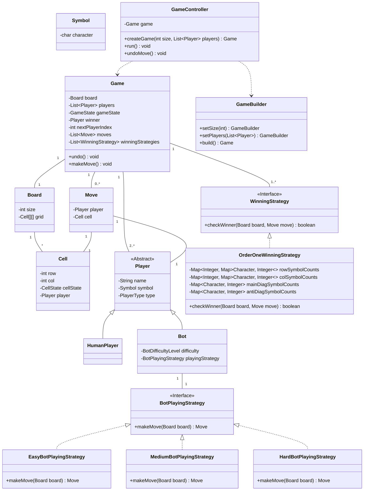

# Low-Level Design: Tic-Tac-Toe

This document outlines the low-level design and implementation of a Tic-Tac-Toe game. It's intended as a comprehensive guide covering requirements, design patterns, and implementation details.

## 1. Requirements

### Functional Requirements:
- **Game Board:** The game will be played on a square board of size `N x N`.
- **Players:** The game will support `N-1` players.
- **Player Types:** A player can be either a `HUMAN` or a `BOT`.
- **Player Symbols:** Each player must have a unique symbol (e.g., 'X', 'O').
- **Game Play:**
    - Players take turns to place their symbol on an empty cell of the board.
    - A player cannot make a move in a cell that is already occupied.
- **Winning Condition:** A player wins if they manage to place their symbols in an entire row, column, or diagonal.
- **Draw Condition:** The game is a draw if the board is full and no player has won.
- **Bot Players:** The game will support bots with varying difficulty levels:
    - **Easy:** The bot makes a random valid move.
    - **Medium:** The bot will try to block an opponent's winning move. If not possible, it makes a random move.
    - **Hard:** The bot uses an optimal algorithm (like Minimax) to determine the best possible move.
- **Undo:** The game will support a global undo feature, allowing the last move (or a series of moves) to be reverted.
- **Reset:** The game can be reset to its initial state at any time.

### Non-Functional Requirements:
- **User Interface:** The game will be playable via a Command-Line Interface (CLI).
- **Language:** The application will be implemented in Java.
- **Performance:** The algorithm to check for a winner after each move should be highly efficient, aiming for O(1) time complexity.
- **Extensibility:** The design should be extensible, particularly for adding new bot strategies or winning conditions.

---

## 2. Class Diagram

The following diagram illustrates the high-level design of the system.

*Note: The ASCII diagram has been replaced with a MermaidJS diagram for better readability.*

---

## 3. Algorithms and Design Patterns

### O(1) Win-Checking Algorithm

To meet the performance requirement of checking for a winner in constant time, we avoid iterating over the board after each move. Instead, we use a stateful strategy that keeps track of symbol counts for each row, column, and diagonal.

#### Data Structures

The `OrderOneWinningStrategy` class maintains the following data structures:
- `Map<Integer, Map<Character, Integer>> rowSymbolCounts`: Stores the count of each player's symbol for every row.
- `Map<Integer, Map<Character, Integer>> colSymbolCounts`: Stores the count of each player's symbol for every column.
- `Map<Character, Integer> mainDiagSymbolCounts`: Stores the count of each player's symbol for the main diagonal (top-left to bottom-right).
- `Map<Character, Integer> antiDiagSymbolCounts`: Stores the count of each player's symbol for the anti-diagonal (top-right to bottom-left).

#### Logic on Each Move

When a player makes a move, the `checkWinner` method in the strategy is called. It performs the following steps:
1.  It identifies the `row`, `col`, and `symbol` of the move.
2.  It increments the count for the given `symbol` in the corresponding maps for the `row` and `col`.
3.  If the move lies on the main diagonal (`row == col`), it increments the count in `mainDiagSymbolCounts`.
4.  If the move lies on the anti-diagonal (`row + col == size - 1`), it increments the count in `antiDiagSymbolCounts`.
5.  After each increment, it checks if the new count for the symbol is equal to the board's size (`N`). If it is, a winner is found, and the method returns `true`.
6.  If none of the counts reach `N`, the method returns `false`.

This approach ensures that checking for a winner is an O(1) operation, as it only involves a few map lookups and updates, regardless of the board's size.

### Bot Playing Strategy (Strategy Pattern)

To accommodate different bot difficulty levels (Easy, Medium, Hard) and allow for easy extension in the future, we use the **Strategy Design Pattern**.

- **`BotPlayingStrategy` Interface:** This interface defines a single method, `Cell makeMove(Board board)`. Each concrete strategy will implement this method to provide its own logic for choosing a cell.
- **Concrete Strategies:** We have classes like `EasyBotPlayingStrategy`, `MediumBotPlayingStrategy`, etc., each implementing the interface. For now, they all use a simple random-move logic, but they can be enhanced independently.
- **`Bot` Class:** The `Bot` class holds a reference to a `BotPlayingStrategy` object. When the bot needs to make a move, it delegates the task to its strategy object.
- **`BotPlayingStrategyFactory`:** A factory is used to create the appropriate strategy object based on the `BotDifficultyLevel` provided when the bot is created. This decouples the `Bot` class from the specifics of strategy creation.

#### Design Decision: `makeMove` Method Signature

An important design decision was the signature of the `makeMove` method in the `BotPlayingStrategy` interface. We considered three options:

1.  **Return a partial `Move` (`Move makeMove(Board board)`):** The strategy would create a `Move` object with the chosen `Cell` but a `null` `Player`. The `Bot` class would then need to set itself as the player on the returned `Move`. This approach was rejected because it creates a `Move` object in an incomplete state.
2.  **Return a `Cell` (`Cell makeMove(Board board)`):** The strategy is only responsible for its core task: the "intelligence" of picking a cell. The `Bot` class then takes the returned `Cell` and constructs the final, complete `Move` object. **This option was chosen** as it provides the best separation of concerns.
3.  **Pass the `Bot` as a parameter (`Move makeMove(Board board, Player bot)`):** The `Bot` would pass a reference to itself to the strategy, allowing the strategy to create a complete `Move` object. This was considered a viable but slightly less clean option than #2, as it increases the coupling between the strategy and the `Player` model.

### Undo Feature Implementation

The undo feature allows a player to revert the last move. Our implementation supports this by reversing the state changes caused by a move.

- **Command Handling:** The undo process is initiated when a human player types "undo" instead of providing coordinates for a move. To handle this without complicating the return types of our methods, we use a custom exception:
    - The `HumanPlayer.makeMove()` method detects the "undo" command and throws a special `UndoCommandException`.
    - The main game loop in `GameController` wraps the call to `makeMove()` in a `try-catch` block. When it catches the `UndoCommandException`, it triggers the undo logic instead of processing a move.
- **Reverting State:** The core undo logic resides in the `Game.undo()` method. When called, it performs the following actions:
    1.  It removes the most recent `Move` from the list of moves.
    2.  It reverts the affected `Cell` on the board to its previous state (`EMPTY` and `player = null`).
    3.  It calls a new method, `handleUndo()`, on the `OrderOneWinningStrategy` to decrement the symbol counts in its internal maps, keeping the O(1) win-checker's state consistent with the board.
    4.  It adjusts the `nextPlayerIndex` to give the turn back to the previous player.
    5.  It resets the `gameState` from `ENDED` or `DRAW` back to `IN_PROGRESS`.
